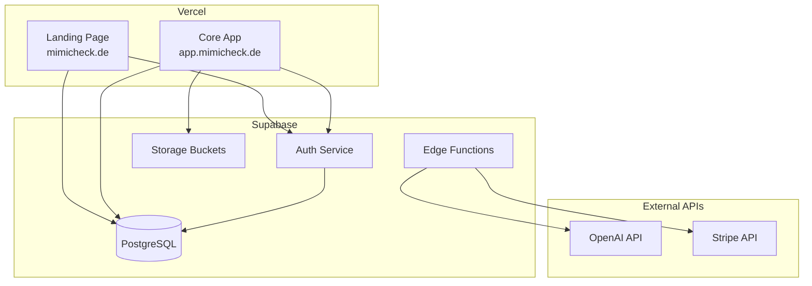

# Design Document: MiMiCheck Beta Launch Deployment

## Overview

Dieses Design-Dokument beschreibt die technische Umsetzung für den Beta-Launch von MiMiCheck auf Vercel. Das Ziel ist die Zusammenführung der Landing Page (mimicheck-landing) und der Core App (src) zu einer einheitlichen, produktionsreifen Anwendung.

### Architektur-Entscheidung

**Option gewählt: Monorepo mit zwei Vercel-Deployments**

```
mimicheck/
├── mimicheck-landing/     → Vercel Deployment 1 (mimicheck.de)
│   └── Auth, Landing, Marketing
├── src/                   → Vercel Deployment 2 (app.mimicheck.de)
│   └── Dashboard, Features, Core App
└── supabase/              → Shared Backend
    └── Auth, DB, Edge Functions
```

**Begründung:**
- Unabhängige Deployments ermöglichen schnellere Iterationen
- Unterschiedliche Tech-Stacks (React 19 vs React 18) bleiben getrennt
- Gemeinsame Supabase-Instanz für Auth-Session-Sharing

## Architecture



## Components and Interfaces

### 1. Landing Page (mimicheck-landing)

**Verantwortlichkeiten:**
- Marketing-Seiten (Hero, Features, Pricing)
- Auth-Flow (Login, Register, Password Reset)
- Kontaktformular
- Redirect zur Core App nach Login

**Technologie:**
- React 19, TypeScript, Tailwind v4
- Wouter für Routing
- Supabase Auth SDK

### 2. Core App (src)

**Verantwortlichkeiten:**
- Dashboard mit Übersicht
- Profil-Verwaltung
- Abrechnungen-Upload und Analyse
- Anträge-Verwaltung
- AI-Assistent

**Technologie:**
- React 18, JavaScript, Vite
- React Router v7
- Supabase Client SDK

### 3. Supabase Backend

**Komponenten:**
- **Auth:** Email/Password, OAuth (optional)
- **Database:** PostgreSQL mit RLS
- **Edge Functions:** AI-Analyse, Stripe Webhooks
- **Storage:** PDF-Uploads

## Data Models

Die Datenmodelle sind bereits in `supabase/migrations/001_initial_schema.sql` definiert:

```typescript
// Hauptentitäten
interface User {
  id: UUID;
  auth_id: UUID;
  email: string;
  full_name: string;
  profile_completeness: number; // 0-100
  subscription_status: 'free' | 'basic' | 'premium';
}

interface Abrechnung {
  id: UUID;
  user_id: UUID;
  titel: string;
  analyse_status: 'wartend' | 'in_bearbeitung' | 'abgeschlossen' | 'fehler';
  rueckforderung_potential: number;
  file_url: string;
}

interface Antrag {
  id: UUID;
  user_id: UUID;
  typ: string;
  status: 'entwurf' | 'eingereicht' | 'bewilligt' | 'abgelehnt';
  formular_daten: JSON;
}
```

## Correctness Properties

*A property is a characteristic or behavior that should hold true across all valid executions of a system-essentially, a formal statement about what the system should do. Properties serve as the bridge between human-readable specifications and machine-verifiable correctness guarantees.*

### Property 1: Keine exponierten Secrets im Quellcode
*For any* JavaScript/TypeScript Datei im Repository, wenn nach API-Key-Patterns gesucht wird (sk-proj, sk_live, sk_test, sk-ant), dann sollen keine Matches in Nicht-.env Dateien gefunden werden.
**Validates: Requirements 1.1**

### Property 2: Environment-Variablen-Validierung
*For any* fehlende VITE_SUPABASE_URL oder VITE_SUPABASE_ANON_KEY Variable, wenn die Anwendung initialisiert wird, dann soll ein Error geworfen werden mit einer Fehlermeldung die den Variablennamen enthält.
**Validates: Requirements 2.1, 2.2**

### Property 3: Protected Route Redirect
*For any* geschützte Route und nicht-authentifizierten Benutzer, wenn die Route aufgerufen wird, dann soll der Benutzer zur Auth-Seite weitergeleitet werden.
**Validates: Requirements 7.2**

### Property 4: RLS Data Isolation
*For any* zwei verschiedene authentifizierte Benutzer A und B, wenn Benutzer A Daten abfragt, dann sollen nur Datensätze mit user_id = A.id zurückgegeben werden, niemals Daten von Benutzer B.
**Validates: Requirements 4.2**

### Property 5: User Profile Auto-Creation
*For any* neuer Benutzer der sich registriert, wenn die Registrierung erfolgreich ist, dann soll ein entsprechender Eintrag in der users Tabelle existieren mit auth_id = auth.users.id.
**Validates: Requirements 4.1**

## Error Handling

### Frontend Error Handling

```javascript
// Zentraler Error Handler
const handleError = (error, context) => {
  // 1. Log für Debugging (nur in Dev)
  if (import.meta.env.DEV) {
    console.error(`[${context}]`, error);
  }
  
  // 2. User-freundliche Nachricht
  const userMessage = getUserFriendlyMessage(error);
  toast.error(userMessage);
  
  // 3. Optional: Error Tracking (Sentry)
  if (import.meta.env.VITE_ENABLE_ERROR_TRACKING) {
    // Sentry.captureException(error);
  }
};

// Supabase-spezifische Fehler
const getUserFriendlyMessage = (error) => {
  const messages = {
    'Invalid login credentials': 'E-Mail oder Passwort falsch.',
    'User already registered': 'Diese E-Mail ist bereits registriert.',
    'Email not confirmed': 'Bitte bestätigen Sie Ihre E-Mail.',
    'default': 'Ein Fehler ist aufgetreten. Bitte versuchen Sie es erneut.'
  };
  return messages[error.message] || messages.default;
};
```

### Supabase Connection Error

```javascript
// In supabaseClient.js
if (!supabaseUrl || !supabaseAnon) {
  const errorMsg = `Supabase Konfiguration fehlt: ${!supabaseUrl ? 'VITE_SUPABASE_URL' : ''} ${!supabaseAnon ? 'VITE_SUPABASE_ANON_KEY' : ''}`;
  
  if (import.meta.env.PROD) {
    throw new Error(errorMsg);
  } else {
    console.error('❌ KRITISCH:', errorMsg);
  }
}
```

## Testing Strategy

### Dual Testing Approach

Die Teststrategie kombiniert Unit-Tests für spezifische Beispiele mit Property-Based Tests für universelle Eigenschaften.

### Unit Tests (Vitest)

```javascript
// Beispiel: Auth-Flow Tests
describe('Auth Flow', () => {
  it('should redirect to auth when not logged in', () => {
    // Spezifisches Beispiel
  });
  
  it('should show error message for invalid credentials', () => {
    // Edge Case
  });
});
```

### Property-Based Tests (fast-check)

**Testing Library:** `fast-check` für JavaScript/TypeScript

**Konfiguration:** Minimum 100 Iterationen pro Property

```javascript
import fc from 'fast-check';

// Property 1: Keine exponierten Secrets
describe('Security Properties', () => {
  it('**Feature: beta-launch-deployment, Property 1: Keine exponierten Secrets im Quellcode**', async () => {
    const sourceFiles = await glob('src/**/*.{js,jsx,ts,tsx}');
    const secretPatterns = [/sk-proj-[a-zA-Z0-9]+/, /sk_live_[a-zA-Z0-9]+/, /sk-ant-[a-zA-Z0-9]+/];
    
    for (const file of sourceFiles) {
      const content = await fs.readFile(file, 'utf-8');
      for (const pattern of secretPatterns) {
        expect(content).not.toMatch(pattern);
      }
    }
  });
});

// Property 2: Environment-Validierung
describe('Environment Properties', () => {
  it('**Feature: beta-launch-deployment, Property 2: Environment-Variablen-Validierung**', () => {
    fc.assert(
      fc.property(
        fc.constantFrom('VITE_SUPABASE_URL', 'VITE_SUPABASE_ANON_KEY'),
        (missingVar) => {
          const originalValue = process.env[missingVar];
          delete process.env[missingVar];
          
          expect(() => initSupabase()).toThrow(missingVar);
          
          process.env[missingVar] = originalValue;
        }
      ),
      { numRuns: 100 }
    );
  });
});

// Property 3: Protected Route Redirect
describe('Routing Properties', () => {
  it('**Feature: beta-launch-deployment, Property 3: Protected Route Redirect**', () => {
    fc.assert(
      fc.property(
        fc.constantFrom('/profilseite', '/upload', '/abrechnungen', '/antraege'),
        (protectedRoute) => {
          // Simuliere nicht-authentifizierten Zustand
          const result = renderWithRouter(<ProtectedRoute><TestComponent /></ProtectedRoute>, {
            route: protectedRoute,
            isAuthenticated: false
          });
          
          expect(result.location.pathname).toBe('/auth');
        }
      ),
      { numRuns: 100 }
    );
  });
});
```

### Integration Tests

- Supabase Auth-Flow mit echtem Backend
- RLS-Policy-Validierung
- Edge Function Tests

## Deployment Configuration

### Vercel Configuration (Root - Core App)

```json
// vercel.json (Root)
{
  "buildCommand": "npm run build",
  "outputDirectory": "dist",
  "framework": "vite",
  "rewrites": [
    { "source": "/(.*)", "destination": "/index.html" }
  ],
  "headers": [
    {
      "source": "/(.*)",
      "headers": [
        { "key": "X-Frame-Options", "value": "DENY" },
        { "key": "X-Content-Type-Options", "value": "nosniff" },
        { "key": "X-XSS-Protection", "value": "1; mode=block" },
        { "key": "Referrer-Policy", "value": "strict-origin-when-cross-origin" }
      ]
    },
    {
      "source": "/assets/(.*)",
      "headers": [
        { "key": "Cache-Control", "value": "public, max-age=31536000, immutable" }
      ]
    }
  ]
}
```

### Environment Variables (Vercel Dashboard)

**Landing Page (mimicheck-landing):**
- `VITE_SUPABASE_URL`
- `VITE_SUPABASE_ANON_KEY`
- `VITE_STRIPE_PUBLISHABLE_KEY`
- `VITE_APP_URL` (URL zur Core App)

**Core App (Root):**
- `VITE_SUPABASE_URL`
- `VITE_SUPABASE_ANON_KEY`
- `VITE_STRIPE_PUBLISHABLE_KEY`
- `VITE_LANDING_URL` (URL zur Landing Page)

### Supabase Secrets (Edge Functions)

```bash
# Diese Secrets müssen im Supabase Dashboard gesetzt werden:
npx supabase secrets set OPENAI_API_KEY=sk-proj-...
npx supabase secrets set ANTHROPIC_API_KEY=sk-ant-...
npx supabase secrets set STRIPE_SECRET_KEY=sk_live_...
npx supabase secrets set STRIPE_WEBHOOK_SECRET=whsec_...
```

## Security Considerations

### 1. API Key Management
- Alle Secrets nur in Umgebungsvariablen
- Keine Fallback-Werte im Code
- Separate Keys für Dev/Prod

### 2. Authentication
- Supabase Auth mit JWT
- Session-Refresh automatisch
- Secure Cookie-Handling

### 3. Data Protection
- RLS auf allen Tabellen
- DSGVO-konforme Datenhaltung
- Verschlüsselte Übertragung (HTTPS)

### 4. DEV_MODE Bypass
- Nur aktiv wenn `window.location.hostname === 'localhost'`
- Wird in Production automatisch deaktiviert
