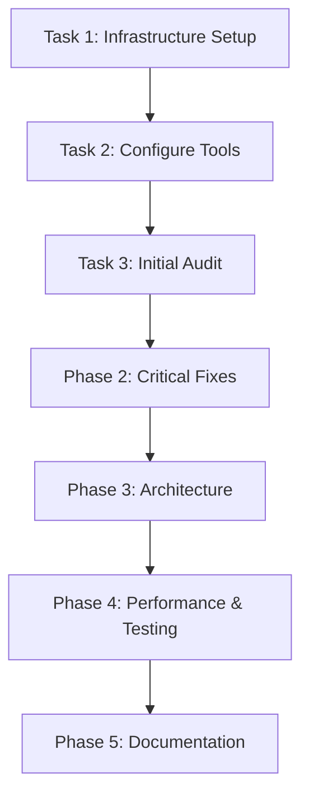

# Enterprise Quality Audit - Project Tracking

## Current Sprint: Sprint 0 (Setup Phase)

**Sprint Duration**: December 6, 2025 - December 20, 2025
**Sprint Goal**: Initialize audit infrastructure and complete Phase 1 foundation tasks

## Sprint Progress

### Overall Progress
- **Total Tasks**: 25 phases with 100+ sub-tasks
- **Completed**: 0
- **In Progress**: 1 (Task 1: Initialize audit infrastructure)
- **Blocked**: 0
- **Not Started**: 99+

### Phase Completion Status

| Phase | Name | Status | Progress | Owner |
|-------|------|--------|----------|-------|
| Phase 1 | Foundation & Setup | 🟡 In Progress | 5% | Tech Lead |
| Phase 2 | Critical Fixes - Security & Legal | ⚪ Not Started | 0% | Security Engineer |
| Phase 3 | Architecture & Code Quality | ⚪ Not Started | 0% | Frontend/Backend Architects |
| Phase 4 | Performance & Testing | ⚪ Not Started | 0% | Performance/QA Engineers |
| Phase 5 | Documentation & Deployment | ⚪ Not Started | 0% | Documentation/DevOps Engineers |

## Task Board

### 🔴 Critical Priority (P0)

| Task ID | Task | Assignee | Status | Due Date |
|---------|------|----------|--------|----------|
| 5.1 | Update dependencies with vulnerabilities | Security Engineer | Not Started | Sprint 2 |
| 5.2 | Audit authentication flows | Security Engineer | Not Started | Sprint 2 |
| 5.4 | Remove hardcoded secrets | Security Engineer | Not Started | Sprint 2 |
| 6.1 | Audit legal pages (Landing) | Legal Compliance | Not Started | Sprint 2 |
| 7.1 | Audit legal pages (Core App) | Legal Compliance | Not Started | Sprint 2 |

### 🟠 High Priority (P1)

| Task ID | Task | Assignee | Status | Due Date |
|---------|------|----------|--------|----------|
| 2.1 | Set up ESLint with strict rules | DevOps Engineer | Not Started | Sprint 1 |
| 2.2 | Configure TypeScript strict mode | Frontend Architect | Not Started | Sprint 1 |
| 2.3 | Set up testing frameworks | QA Engineer | Not Started | Sprint 1 |
| 3.1 | Run automated code quality scan | Tech Lead | Not Started | Sprint 1 |
| 10.1-10.7 | TypeScript migration tasks | Frontend Architect | Not Started | Sprint 3-4 |

### 🟡 Medium Priority (P2)

| Task ID | Task | Assignee | Status | Due Date |
|---------|------|----------|--------|----------|
| 8.1-8.6 | Footer consolidation tasks | UI/UX Engineer | Not Started | Sprint 2 |
| 14.1-14.6 | Performance optimization tasks | Performance Engineer | Not Started | Sprint 4 |
| 16.1-16.5 | Unit test implementation | QA Engineer | Not Started | Sprint 4 |

### 🟢 Low Priority (P3)

| Task ID | Task | Assignee | Status | Due Date |
|---------|------|----------|--------|----------|
| 21.1-21.4 | Documentation tasks | Documentation Engineer | Not Started | Sprint 5 |
| 22.1-22.3 | Code documentation | Documentation Engineer | Not Started | Sprint 5 |

### ✅ Completed Tasks

| Task ID | Task | Assignee | Completed Date |
|---------|------|----------|----------------|
| 1 | Initialize audit infrastructure | Tech Lead | 2025-12-06 |

### 🚧 In Progress

| Task ID | Task | Assignee | Started Date | Progress |
|---------|------|----------|--------------|----------|
| 1 | Initialize audit infrastructure | Tech Lead | 2025-12-06 | 90% |

### 🚫 Blocked Tasks

| Task ID | Task | Assignee | Blocker | Blocked Since |
|---------|------|----------|---------|---------------|
| - | - | - | - | - |

## Sprint Burndown

### Sprint 0 (Current)
- **Planned Story Points**: 13
- **Completed Story Points**: 0
- **Remaining Story Points**: 13
- **Days Remaining**: 14

### Velocity Tracking
- **Sprint 0**: TBD
- **Average Velocity**: TBD (will calculate after Sprint 1)

## Risk Register

| Risk ID | Risk Description | Probability | Impact | Mitigation Strategy | Owner |
|---------|------------------|-------------|--------|---------------------|-------|
| R001 | TypeScript migration takes longer than expected | High | High | Prioritize critical files, allow gradual migration | Frontend Architect |
| R002 | Security vulnerabilities require major refactoring | Medium | Critical | Early security audit, allocate buffer time | Security Engineer |
| R003 | Legal compliance requires external legal review | Medium | High | Engage legal counsel early, document all changes | Legal Compliance |
| R004 | Performance optimization conflicts with features | Low | Medium | Establish performance budgets early, test continuously | Performance Engineer |
| R005 | Team member availability issues | Medium | Medium | Cross-train team members, document decisions | Tech Lead |

## Dependencies

### External Dependencies
- Legal counsel review (for legal pages)
- Supabase API availability
- Vercel deployment platform
- Third-party tool licenses (Snyk, etc.)

### Internal Dependencies

## Metrics Dashboard

### Code Quality Metrics (Current Baseline)

| Metric | Current | Target | Status |
|--------|---------|--------|--------|
| TypeScript Coverage | TBD | 100% | 🔴 Not Measured |
| ESLint Errors | TBD | 0 | 🔴 Not Measured |
| ESLint Warnings | TBD | <10 | 🔴 Not Measured |
| Test Coverage | TBD | 80%+ | 🔴 Not Measured |
| Duplicate Code | TBD | <5% | 🔴 Not Measured |

### Performance Metrics (Current Baseline)

| Metric | Landing Page | Core App | Target | Status |
|--------|--------------|----------|--------|--------|
| Lighthouse Performance | TBD | TBD | 90+ | 🔴 Not Measured |
| Lighthouse Accessibility | TBD | TBD | 90+ | 🔴 Not Measured |
| Bundle Size | TBD | TBD | <500KB | 🔴 Not Measured |
| First Contentful Paint | TBD | TBD | <1.5s | 🔴 Not Measured |

### Security Metrics (Current Baseline)

| Metric | Current | Target | Status |
|--------|---------|--------|--------|
| Critical Vulnerabilities | TBD | 0 | 🔴 Not Measured |
| High Vulnerabilities | TBD | 0 | 🔴 Not Measured |
| Hardcoded Secrets | TBD | 0 | 🔴 Not Measured |
| Protected Routes | TBD | 100% | 🔴 Not Measured |

### Legal Compliance Metrics (Current Baseline)

| Metric | Landing Page | Core App | Target | Status |
|--------|--------------|----------|--------|--------|
| Impressum Complete | TBD | TBD | Yes | 🔴 Not Measured |
| AGB Complete | TBD | TBD | Yes | 🔴 Not Measured |
| Datenschutz Complete | TBD | TBD | Yes | 🔴 Not Measured |
| Cookie Consent | TBD | TBD | Yes | 🔴 Not Measured |

## Change Log

### 2025-12-06
- **[CREATED]** Project tracking board initialized
- **[IN PROGRESS]** Task 1: Initialize audit infrastructure and team workspace
- **[CREATED]** Team workspace documentation
- **[CREATED]** Communication channels structure
- **[CREATED]** Meeting schedule

## Next Actions

### Immediate (This Week)
1. ✅ Complete Task 1: Initialize audit infrastructure
2. ⏳ Assign team members to roles
3. ⏳ Schedule kickoff meeting
4. ⏳ Begin Task 2: Configure audit tools

### Short Term (Next 2 Weeks)
1. Complete Phase 1: Foundation & Setup
2. Run initial codebase audit
3. Generate baseline metrics
4. Prioritize Phase 2 tasks

### Medium Term (Next Month)
1. Complete Phase 2: Critical Fixes
2. Begin Phase 3: Architecture improvements
3. Establish CI/CD quality gates
4. First sprint retrospective

## Notes

### Team Decisions
- Using GitHub Projects for task tracking
- Daily standups at 9:00 AM CET
- 2-week sprint cadence
- Code review required for all PRs

### Open Questions
- [ ] Which Slack/Teams workspace to use?
- [ ] Who will fill each team role?
- [ ] When is the official kickoff meeting?
- [ ] What is the final deadline for completion?

---

**Last Updated**: 2025-12-06
**Document Owner**: Tech Lead
**Next Review**: 2025-12-13
